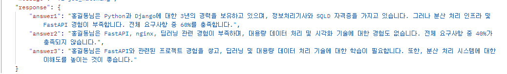

# AI 아키텍처

> 프레임워크 : FastAPI + LangChain
> AI 모델 : OpenAI gpt-4o-mini, Ollama nomic-embed-text

## 전체 아키텍처 흐름 요약

```plaintext
[외부 API] → (채용공고 JSON 응답)
        ↓
[🌐 백엔드 서버 (FastAPI)]
        ↓
[📦 ChatGPT API 호출 (프롬프트 + 채용공고 JSON + 사용자 정보)]
        ↓
[✅ 정리된 분석 결과 (충족, 부족, 역량 추천)]
        ↓
[REST API 형태로 프론트엔드에 응답]
```

## 구성 요소 정리

1. 외부 채용공고 API 호출
2. ChatGPT 프롬프트 구성
3. OpenAI API 호출
4. 전체 API 엔드포인트

## 폴더 구조

```planetext
ai-job-matcher/
├── app/
│ ├── main.py ← FastAPI 엔트리포인트
│ ├── api/
│ │ └── v1/
│ │ └── job_matcher.py ← 취업 매칭 API 라우터
│ ├── core/
│ │ └── config.py ← 환경 설정 (Settings) 모듈
│ ├── models.py ← Pydantic 모델 정의 (JobMatchingRequest, JobMatchingResponse 등)
│ └── services/
│ └── job_matcher_service.py ← 채용 공고 매칭 분석 로직 (LangChain, OpenAI 연동)
├── requirements.txt ← 의존성 관리 파일
├── .gitignore
└── .env ← 환경 변수 설정 파일
```

## .env

```plaintext
OPENAI = {"api_key": your-api-key, "model": "gpt-4o-mini", "temperature": 0.5,"max_tokens": 1000,"top_p": 1,"frequency_penalty": 0,"presence_penalty": 0}

OLLAMA_EMBEDDING = {"model": "nomic-embed-text", "temperature": 0.5, "max_tokens": 1000, "top_p": 1, "frequency_penalty": 0, "presence_penalty": 0}

PINECONE = {"api_key": your-api-key, "index_name": index_name, "environment": env}
```

## TEST 결과

250409



## 모델 및 서비스 구성

- **Pydantic 모델**

  - `JobMatchingRequest`: 채용 공고 ID와 후보자 정보(예. name, skills, experience 등)를 포함합니다.
  - `JobMatchingResponse`: LLM 분석 결과를 구조화된 형태로 반환하며, 후보자의 강점, 약점, 개선 사항 등을 담습니다.
- **서비스 로직 (job_matcher_service.py)**

  - 외부 벡터 DB (Pinecone)를 통해 채용공고 데이터를 검색하고,
  - LangChain 프롬프트를 생성해 LLM에 전달합니다.
  - 프롬프트는 후보자 정보를 기반으로 강점, 미흡점, 개선 사항을 분석하도록 구성되어 있으며, LLM은 반드시 한국어로 응답해야 합니다.
  - 응답은 `ChatOpenAI`와 구조화된 출력 체인을 통해 `JobMatchingResponse` 모델로 파싱됩니다.

## 실행 방법

1. 프로젝트 루트 디렉토리에서 필요한 패키지를 설치합니다.

```bash
pip install -r requirements.txt
```

2. `.env` 파일에 필요한 환경변수를 설정합니다.
3. 서버를 실행합니다. (예: uvicorn 사용)

```bash
uvicorn app.main:app --reload
```

4. 지정된 API 엔드포인트로 요청을 보내어 채용 공고와 후보자 정보를 전달하면, LLM이 분석한 결과가 구조화된 JSON 형태로 반환됩니다.
